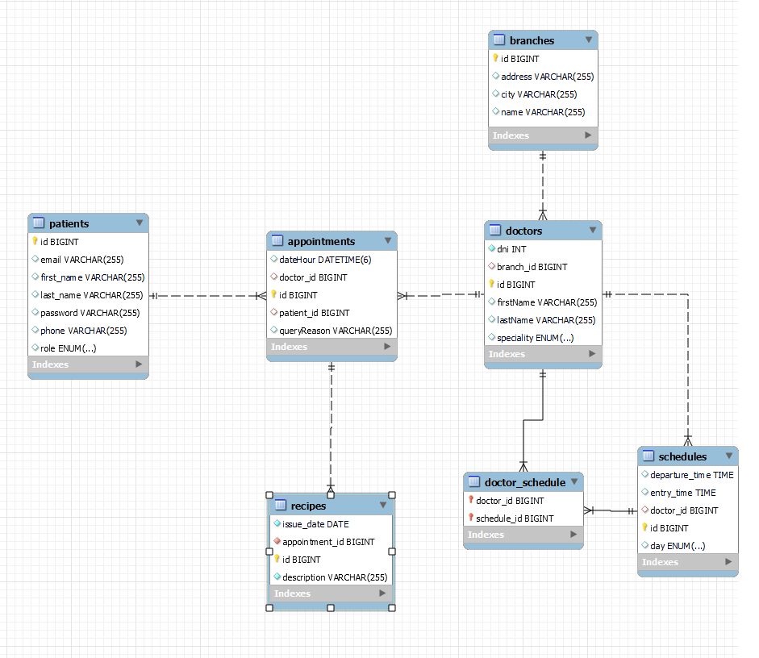

# Trabajo Integrador Grupo 10

## Tecnologias usadas

- Quarkus
- Hibernate ORM
- Panache
- MapStruct
- RESTEasy
- Lombok
- MySQL
- SmallRye OpenAPI
- Quarkus Extension for Spring Security API
- SmallRye JWT
- ArC
- Hibernate Validator

## Instrucciones de instalacion

1. **Clona el repositorio:**
   ```bash
   git clone https://github.com/NicolasIppoliti/trabajo-integrador-grupo-10.git
   cd trabajo-integrador-grupo-10
   ```
2. **Configura tu base de datos:**
   ```bash
   Actualiza tu archivo application.properties con tus datos de conexion a la base de datos. Por defecto utiliza variables de entorno, pero como alternativa esta seteado root como username y 123456 como password.
   Necesitaras una base de datos vacia llamada almedin.
   Drop database if exists almedin;
   Create database if not exists almedin;
   ```
   Puedes ver el archivo de configuración completo en [application.properties](./src/main/resources/application.properties).
3. **Iniciar la aplicacion:**
   ```bash
   ./mvnw quarkus:dev
   ```
Por defecto su aplicacion iniciara cargando varios insert que se encuntran en el archivo `import.sql` de la carpeta resources. En caso de querer trabajar sin los insert puede comentar todos los registros o remover dicho archivo, pero recomiendo encarecidamente que se usen esos datos de prueba, ya que este sistema esta pensado en ser escalable y tener algunas caracteristicas "un tanto realistas" que suman algo de complejidad para llegar al momento de tener todos los objetos cargados para hacer las pruebas.

## Diagrama Entidad-Relacion de la aplicación


## API Endpoints
## Swagger de OpenApi: http://localhost:8080/swagger-ui/#/
Para probar los endpoints con facilidad, sin necesidad de cargar todo manual en Postman incluimos SmallRye OpenAPI implementando su interfaz grafica de navegador. Alli podra continuar probando el proyecto.

## Pacientes:
   **Crear un paciente:**
 Este endpoint permite la creación de un nuevo paciente con ciertas restricciones de validación para el email, número de teléfono y contraseña.

- **Restricciones:**
  - El email debe tener un formato válido y no debe estar repetido.
  - El número de teléfono debe ser único.
  - La contraseña debe tener un mínimo de 8 caracteres, incluyendo al menos 1 mayúscula, 1 minúscula, 1 número y 1 caracter especial.
  - El role es un ENUM que puede ser `PATIENT`, `ADMIN` o `AUTHORIZED_PATIENT` (este último se utiliza en un endpoint protegido).
   
   - URL: `/pacientes`
   - Method: `POST`
   - Request Body:
   ```json
   {
      "firstName": "John",
      "lastName": "Doe",
      "email": "john.doe@example.com",
      "password": "Securepassword12-",
      "phone": "1234567890",
      "role":  "PATIENT"
   }
   ```
   - Response: 201
   ```json
   {
     "id":  1,
     "firstName": "John",
      "lastName": "Doe",
      "email": "john.doe@example.com",
      "password": "Securepassword12-",
      "phone": "1234567890",
      "role":  "PATIENT"
   }
   ```
   **Obtener todos los pacientes:**
   - URL: `/pacientes`
   - Method: `GET`
   - Response:
   ```json
   [
      {
         "id": 1,
         "firstName": "John",
         "lastName": "Doe",
         "email": "john.doe@example.com",
         "phone": "1234567890",
         "password": "Securepassword12-",
         "role":  "PATIENT"
      }
   ]
   ```
   **Obtener paciente por ID:**
   - URL: `/pacientes/{id}`
   - Method: `GET`
   - Response:
   ```json
   {
      "id": 1,
      "firstName": "John",
      "lastName": "Doe",
      "email": "john.doe@example.com",
      "password": "securepassword",
      "phone": "1234567890"
   }
    ```
   **Actualizar paciente por id:**
   - URL: `/paciente{id}`
   - Method: `PUT`
    Metodo por defecto que actualizara la sucursal cuyo id sea ingresado, tiene el mismo cuerpo que el metodo create, se intente o no setear el ID, este no  sera tenido en cuenta.
  ```
  **Eliminar paciente por id:**
   - URL: `/paciente{id}`
   - Method: `DELETE`
    Metodo por defecto que eliminara el paciente cuyo id sea ingresado.
  ```
  
## Autenticación:

   #### Iniciar sesión
Este endpoint permite que un usuario ingrese su email y contraseña y le devolvera un JWT que podra usar para interactuar con endpoints protegidos, en este caso el endpoint de `GET` `/recetas/{id}`.
- **URL:** `/auth/login`
- **Método:** `GET`
- **Query Param:**
```json
      {
         "email": "john.doe@example.com",
         "password": "Securepassword12-"
      }
   ```

   #### Registrar usuario
Este endpoint es similar al de `POST` `/especialistas`, ingresando incluso el mismo cuerpo, pero aqui sin importar el rol que especifiques, sera seteado como `PATIENT`. Tambien te devolvera un Token como String que puedes usar para validar tu sesión.
- **URL:** `/auth/register`
- **Método:** `POST`
- **Request Body:**
```json
   [
      {
         "id": 1,
         "firstName": "John",
         "lastName": "Doe",
         "email": "john.doe@example.com",
         "phone": "1234567890",
         "password": "Securepassword12-",
         "role":  "PATIENT"
      }
   ]
   ```

## Sucursales:

   #### Crear una sucursal
Este endpoint permite la creación de una nueva sucursal. Las mismas son necesarias para luego crear un especialista, que debe estar relacionado a una.

- **URL:** `/sucursales`
- **Método:** `POST`
- **Request Body:**
  ```json
  {
    "name": "Sucursal Central",
    "address": "123 Calle Principal",
    "city": "Ciudad Ejemplo"
  }
  ```
   }
   ```
   - Response: 201
   ```json
   {
    "id": 1,
    "name": "Sucursal Central",
    "address": "123 Calle Principal",
    "city": "Ciudad Ejemplo"
  }
   ```
   **Obtener todos las sucursales:**
   - URL: `/sucursales`
   - Method: `GET`
    - Metodo por defecto que devolvera un listado de todas las sucursales en formato Json.

   **Obtener sucursal por id:**
   - URL: `/sucursales{id}`
   - Method: `GET`
   - Metodo por defecto que devolvera una sucursal cuyo id coincida con el ingresado, en formato Json.


   **Actualizar sucursal por id:**
   - URL: `/sucursales{id}`
   - Method: `PUT`
   - Metodo por defecto que actualizara la sucursal cuyo id sea ingresado, tiene el mismo cuerpo que el metodo create, se intente o no setear el ID, este no  sera tenido en cuenta.

  **Eliminar sucursal por id:**
   - URL: `/sucursales{id}`
   - Method: `DELETE`
   - Metodo por defecto que eliminara la sucursal cuyo id sea ingresado, en caso de no tener un doctor relacionado a la misma.

## Horarios:
   #### Crear un horario
Este endpoint permite la creación de un nuevo horario. Las mismos deberean lugo asignarsele a un medico, y de aqui sale la logica para definir si un medico puede tomar una cita o no. Sugiero usar los datos que vienen en el import.sql del proyecto para evitar la complejidad que antecede a probar el sistema. Day es un enum que contiene los dias en ingles y mayusculas (MONDAY, TUESDAY, WEDNESDAY, THURSDAY, FRIDAY, SATURDAY, SUNDAY)

- **URL:** `/horarios`
- **Método:** `POST`
- **Request Body:**
  ```json
  {
    "day": "MONDAY",
    "entryTime": "08:00:00.00000000",
    "departureTime": "17:00:00.00000000"
  }
  ```
Este metodo devolvera un 201.OK y el cuerpo del Horario creado, incluyendo su id.

  Tambien hay endpoints para el resto de sus metodos CRUD como:
- getAll (`GET` sobre `/horarios`)
- getById(`GET` sobre `/horarios{id_horario}`)
- updateSchedule(`PUT` sobre `/horarios{id_horario}`, mismo cuerpo que el POST)
- deleteSchedule(`DELETE` sobre `/horarios{id_horario}`)

## Especialistas:
   **Crear un especialista:**
- Este endpoint creara un especialista, a tener en cuenta que su DNI no tiene que estar repetido y su branch_id debe ser de una sucursal creada previamente.
- El campo `speciality` es un `ENUM` que puede tomar cualquiera de los siguientes valores: CLINICA_MEDICA, CIRUGIA, DERMATOLOGIA, PEDIATRIA, GINECOLOGIA, ENDOCRINOLOGIA,TRAUMATOLOGIA.

   - URL: `/especialistas`
   - Method: `POST`
   - Request Body:
   ```json
   {
      "firstName": "Jane",
      "lastName": "Doe",
      "dni": 12345678,
      "speciality": "CLINICA_MEDICA",
      "branch_id": 1
   }
   ```
  Su respuesta sera un 201 y el cuerpo del especialista con su ID asignado e informacion sobre la sucursal del mismo en formato Json.

   **Obtener todos los especialistas:**
   - URL: `/especialistas`
   - Method: `GET`
  Devuelve una lista de especialistas, con informacion de los mismos, la sucursal a la que pertenecen (nombre, direccion, ciudad) y un listado de los horarios que cumplen por dia (dia, hora de entrada y hora de salida).

  **Obtener especialista por Id:**
- URL: `/especialistas{id}`
   - Method: `GET`
  Devuelve informacion de un especialista cuya id sea ingresada en la URL.

  **Actualizar especialista por Id:**
- URL: `/especialistas{id}`
  - Method: `PUT`
  Actualiza los datos de un especialista cuya id sea ingresada en la URL. Tiene el mismo cuerpo que para crear especialista en el POST.

  **Eliminar especialista por Id:**
- URL: `/especialistas{id}`
  - Method: `DELETE`
  Elimina un especialista cuya id sea ingresada en la URL

  **Asignar horario a especialista por Id:**
- URL: `/especialistas/asignar-horario/{id}`
  - Method: `PUT`
  Asigna un horario a la vez a un especialista, la id del especialista va en la URL y la del horario como QueryParam. No permite que un especialista tenga en su set de horarios mas de uno perteneciente al mismo dia (no esta contemplado que salga y vuelva a ofrecer sus    servicios en el mismo dia).
  

## Turnos:

En este endpoint radica la mayoría de la lógica de la aplicación. Los turnos pueden ser pedidos solo a partir del día de mañana y hasta 60 días en el futuro; otro día no se considerará válido. Enviarás una solicitud para una hora y una fecha en específico con el id del especialista que deseas que te atienda, y el motivo de la consulta. Se verificará si el especialista trabaja ese día, si trabaja ese día a esa hora y se verificará que no tenga ningún turno confirmado en un lapso menor a media hora antes del horario que pediste, pues se estima que esto es lo que dura el tiempo. Si cumple con estos requisitos, se confirmará el turno. Desde el frontend se sugerirían los turnos para evitar tantas consultas rechazadas, pero mientras tanto, hay que verificar la cartilla médica y la lista de citas (endpoint no protegido en este estadio de la aplicación).

   **Crear un turno:**
   - URL: `/turnos`
   - Method: `POST`
   - Request Body:
   ```json
   {
     "patientId": 1,
     "doctorId": 1,
     "dateHour": "2024-07-01T10:00:00",
     "queryReason": "Consulta general"
   }
   ```
   - Response: 201
   ```json
   {
      "id": 1,
      "patientId": 1,
      "doctorId": 1,
      "dateHour": "2024-07-01T10:00:00",
      "queryReason": "Consulta general"
   }
   ```
   **Obtener todos los turnos:**
   - URL: `/turnos`
   - Method: `GET`
   - Response:
   ```json
   [
      {
         "id": 1,
         "patientId": 1,
         "doctorId": 1,
         "dateHour": "2024-07-01T10:00:00",
         "queryReason": "Consulta general"
      }
   ]
   ```
   **Obtener turno por ID:**
   - URL: `/turnos/{id}`
   - Method: `GET`
   - Response:
   ```json
   {
     "id": 1,
     "patientId": 1,
     "doctorId": 1,
     "dateHour": "2024-07-01T10:00:00",
     "queryReason": "Consulta general"
   }
   ```
   **Modificar un turno:**
   - Con el id del turno sobre la url, un paciente puede elegir otro dia y horario, especialista y motivo de         consulta. Por este motivo no necesita el id de paciente. Para confirmar sigue la misma logica que el             CreateTurno del Post.
   - URL: `/turnos/{id}`
   - Method: `PUT`
   - Request Body:
   ```json
     {
  "dateHour": "2024-06-17T15:15:50",
  "doctor_id": 2,
  "queryReason": "Ahora me duele la otra pierna"
     }
   
   ```
   - Response:
   ```json
   {
      Respusta similar al Create del POST
   }
   ```
   **Cancelar un turno:**
   - URL: `/turnos/{id}`
   - Method: `DELETE`
   - Response:
   ```json
   {
      204, no content
   }
   ```
## Recetas:
   **Crear una receta:**
   - URL: `/recetas`
   - Method: `POST`
   - Request Body:
   ```json
   {
      "description": "Tomar 2 paracetamol cada 8 horas",
      "appointmentId": 1,
      "issueDate": "2022-03-10"
   }
   ```
   - Response:
   ```json
   {
      Cuerpo de la receta con su respectivo Id
   }
   ```
   **Obtener todas las recetas:**
   - URL: `/recetas`
   - Method: `GET`
   - Response:
   ```json
   [
      {
         "id": 1,
         "description": "Tomar 2 paracetamol cada 8 horas",
         "appointmentId": 1,
         "issueDate": "2022-03-10"
      }
   ]
   ```
   **Obtener receta por ID de la cita relacionada:**
- Este metodo esta protegido, solo pacientes con rol "AUTHORIZED_PATIENT" que se logueen y carguen su JWT Bearer token estan autorizados a interactuar con este endpoint, aun asi,  se limito la posibilidad de que los pacientes autorizados intenten obtener recetas  de citas que no le corresponden iterando su  ID. Puede intntarlo, si esta usando  los insert de prueba su pacient autorizado es Lucre, sus datos de inicio de sesion son email: `lucrecia@gmail.com`, password: `Passw1234-`. Sus citas tienen el ID `1, 4, 7`.  Si intenta cualquier otro numero vera que no le permitira recibir las recetas.
   - URL: `/recetas/{id}`
   - Method: `GET`
   - Response:
   ```json
   {
      "id": 1,
      "description": "Tomar 2 paracetamol cada 8 horas",
      "appointmentId": 1,
      "issueDate": "2022-03-10"
   }
   ```
- Recetas tambien tiene sus metodos tipicos de CRUD como getById(GET /recetas/receta{receta_id})
- updateById (PUT /recetas/receta{receta_id}, mismo cuerpo y respuesta que el POST)
- deleteById (DELETE /recetas/{receta_id} da un 204 como respuesta)
